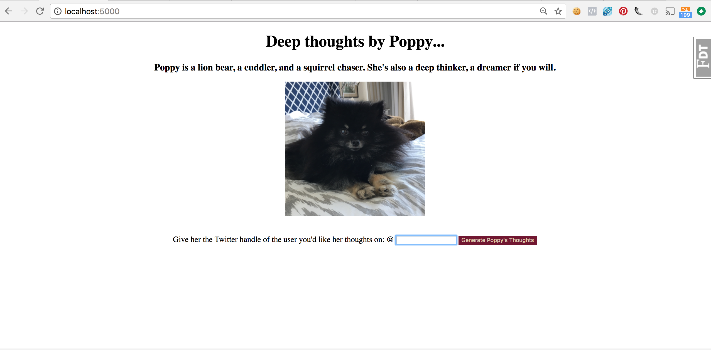
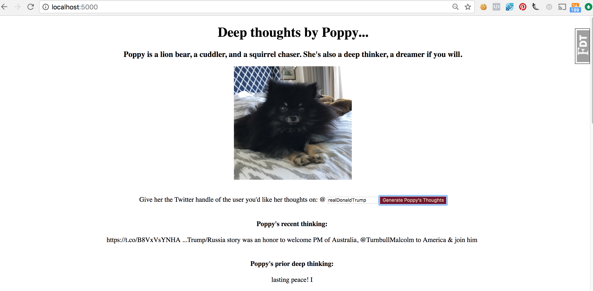

# Tweet Generator
Tweet generator is part of a coding challenge to build tweets using a Twitter user's prior tweets. A user can type in the Twitter handle of anyone with a Twitter history, and get a Markov-chain generated new tweet. If the program has already generated tweets for this user, prior tweets will be displayed as well.

# Technologies
Backend: Python, Flask, PostgreSQL, SQLAlchemy

Frontend: JavaScript, jQuery, AJAX, HTML5, CSS3

APIs: Twitter

# Features
*New Tweet Generation utilizing Markov Chains, based on an existing user's 200 most recent tweets.

*Display of historical machine generated tweets for that Twitter user.

# Installation
To run Audio Articles:

*Install PostgreSQL (Mac OSX)

*Clone or fork this repo:

    *https://github.com/kalliefriedman/deep_thoughts_by_poppy

*Create and activate a virtual environment inside your Tweet Generator directory:

    *virtualenv env

    *source env/bin/activate

*Install the dependencies:

    *pip install -r requirements.txt

*Sign up for a Twitter account and sign up as a new app developer. 

*Set up the database:

    *python model.py

*Run the app:

    *python server.py

*You can now navigate to 'localhost:5000/' to access Tweet Generator

